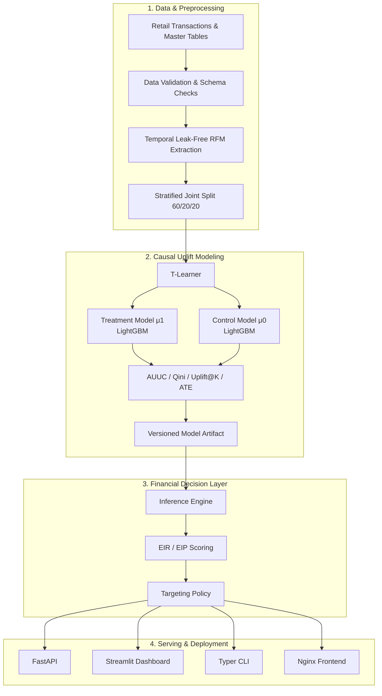

# PromoLift

> **Production-oriented uplift modeling and causal decision engine for retail promotion targeting, built and evaluated on synthetic retail data.**

[](https://github.com/MTPeraya/promolift-model/actions)
[](https://www.python.org/)
[]()
[]()
[]()
[]()
[](https://opensource.org/licenses/MIT)

> **⚠️ Important — Synthetic Data**
>
> PromoLift uses a **synthetic/mock retail dataset**. All model metrics and financial results are **offline simulation benchmarks**, not real-world commercial outcomes. The project demonstrates the engineering and modeling approach rather than claiming validated business impact.

---

## Overview

Retail promotions can waste budget by discounting customers who would have purchased without an incentive.

Traditional propensity modeling asks:

> **"Who is most likely to buy?"**

Uplift modeling asks a different question:

> **"Who is more likely to buy because of the promotion?"**

PromoLift combines **causal uplift modeling**, **financial decisioning**, and **production-style ML engineering** into an end-to-end system.

The system:

1. Validates retail data.
2. Builds temporally leak-free customer features.
3. Splits customers into train, validation, and untouched holdout test sets.
4. Trains a two-model **T-Learner** using LightGBM.
5. Estimates customer-level treatment effects.
6. Evaluates uplift using Qini, AUUC, Uplift@K, and ATE.
7. Converts uplift predictions into expected incremental revenue and profit.
8. Produces targeting decisions such as `TARGET`, `SKIP`, and `SLEEPING DOG`.
9. Serves predictions through FastAPI.
10. Provides a Streamlit campaign optimization dashboard.
11. Supports batch scoring through a Typer CLI.
12. Runs as a multi-service Docker Compose application.

---

## Why Uplift Modeling?

A propensity model may prioritize customers who are already highly likely to purchase.

That can be inefficient for promotional campaigns because a customer who would buy without a discount does not necessarily create incremental value from receiving one.

Uplift modeling instead estimates the difference between the customer's expected outcome under treatment and control.

### Four causal customer groups

| Customer Segment  | Without Promotion | With Promotion | Business Interpretation              | PromoLift Policy    |
| ----------------- | ----------------- | -------------- | ------------------------------------ | ------------------- |
| **Persuadables**  | Would not buy     | Buys           | Promotion creates incremental demand | `TARGET` if EIP > 0 |
| **Sure Things**   | Buys              | Buys           | Discount may cannibalize margin      | `SKIP`              |
| **Lost Causes**   | Would not buy     | Would not buy  | Promotion wastes spend               | `SKIP`              |
| **Sleeping Dogs** | Buys              | Does not buy   | Negative treatment effect            | `SLEEPING DOG`      |

---

## Mathematical Formulation

### 1. Individual Treatment Effect

For customer `i`:

$$
\tau_i =
P(Y=1 \mid W=1, X_i)
-
P(Y=1 \mid W=0, X_i)
$$

where:

* $Y$ = purchase outcome
* $W$ = treatment assignment
* $X_i$ = customer features
* $\tau_i$ = estimated individual treatment effect

PromoLift estimates:

$$
\mu_1(X_i) = P(Y=1 \mid W=1, X_i)
$$

and

$$
\mu_0(X_i) = P(Y=1 \mid W=0, X_i)
$$

using separate treatment and control models.

Therefore:

$$
\tau_i = \mu_1(X_i) - \mu_0(X_i)
$$

### 2. Expected Incremental Revenue

$$
EIR_i =
\tau_i \times Price
-
Discount \times \mu_1(X_i)
$$

### 3. Expected Incremental Profit

$$
EIP_i =
\tau_i \times (Price - COGS)
-
Discount \times \mu_1(X_i)
-
Cost_{campaign}
$$

### Targeting policy

```text
if uplift < 0:
    SLEEPING DOG
elif EIP > 0:
    TARGET
else:
    SKIP
```

The financial layer therefore separates:

**statistical prediction → financial value → business decision**

rather than treating model probability as the final campaign decision.

---

# Architecture



---

# Key Features

### Leakage-safe feature engineering

Customer features are calculated using historical transactions before the campaign reference date:

```text
reference_date = 2026-06-01
```

This prevents post-campaign information from entering the model features.

### Two-model T-Learner

PromoLift trains separate LightGBM classifiers for:

* treated customers: $\mu_1(X)$
* control customers: $\mu_0(X)$

The difference between the two predictions produces the estimated uplift score.

### Causal evaluation

The evaluation package implements:

* Qini curves
* Qini Score
* AUUC
* Uplift@K
* Average Treatment Effect

### Financial optimization

Model predictions are converted into:

* Expected Incremental Revenue
* Expected Incremental Profit
* campaign cost
* discount cost
* targeting recommendations

### Multi-format inference

Batch scoring supports:

* CSV
* Parquet

Online scoring is exposed through FastAPI.

### Production-style serving

The project includes:

* FastAPI
* Uvicorn
* Streamlit
* Nginx
* Docker
* Docker Compose
* health checks
* versioned model artifacts

### Engineering quality

The repository includes:

* pytest
* coverage measurement
* Ruff
* MyPy
* GitHub Actions
* integration tests
* API tests
* regression tests
* unit tests
* Docker smoke tests

---

# Tech Stack

| Area             | Technologies                    |
| ---------------- | ------------------------------- |
| Language         | Python 3.11 / 3.12              |
| Machine Learning | LightGBM, scikit-learn          |
| Data Processing  | pandas, NumPy, PyArrow          |
| Causal Modeling  | T-Learner, Qini, AUUC, Uplift@K |
| Schemas          | Pydantic v2                     |
| Type Checking    | MyPy                            |
| API              | FastAPI, Uvicorn                |
| Dashboard        | Streamlit                       |
| Frontend         | Nginx                           |
| CLI              | Typer, Rich                     |
| Testing          | pytest, pytest-cov              |
| Linting          | Ruff                            |
| Packaging        | pyproject.toml                  |
| Containerization | Docker, Docker Compose          |
| CI               | GitHub Actions                  |

---

# Project Structure

```text
promolift-model/
│
├── Dockerfile
├── docker-compose.yml
├── Makefile
├── pyproject.toml
│
├── .github/
│   └── workflows/
│       └── ci.yml
│
├── data/
│   ├── customer_features.parquet
│   └── data_dictionary.md
│
├── docs/
│   └── validation.md
│
├── models/
│   └── production/
│       ├── model.joblib
│       └── metadata.json
│
├── outputs/
│
├── src/
│   ├── promolift/
│   │   ├── api/
│   │   ├── artifacts/
│   │   ├── business/
│   │   ├── evaluation/
│   │   ├── models/
│   │   ├── cli.py
│   │   ├── features.py
│   │   ├── inference.py
│   │   ├── pipeline.py
│   │   ├── types.py
│   │   └── validation.py
│   │
│   └── app.py
│
└── tests/
    ├── api/
    ├── integration/
    ├── regression/
    └── unit/
```

---

# Quick Start

## Docker — Recommended

Clone the repository:

```bash
git clone https://github.com/MTPeraya/promolift-model.git
cd promolift-model
```

Build and launch the complete stack:

```bash
docker compose up --build
```

The stack contains:

```text
API        → localhost:8000
Dashboard  → localhost:8501
Frontend   → localhost:8080
```

### Verified endpoints

| Service             | Endpoint                           |
| ------------------- | ---------------------------------- |
| Streamlit Dashboard | `http://localhost:8501`            |
| FastAPI Swagger     | `http://localhost:8000/docs`       |
| FastAPI Health      | `http://localhost:8000/health`     |
| Model Information   | `http://localhost:8000/model-info` |
| Web Frontend        | `http://localhost:8080`            |

Run the automated Docker smoke test:

```bash
make docker-test
```

---

# Local Development

## Requirements

* Python 3.11 or 3.12
* Git

Create a virtual environment:

```bash
python3 -m venv .venv
source .venv/bin/activate
```

Install the package:

```bash
pip install --upgrade pip
pip install -e ".[all]"
```

Run tests:

```bash
make test
```

Run linting:

```bash
make lint
```

Run type checking:

```bash
make typecheck
```

---

# Model Training

Train the model using the CLI:

```bash
python3 -m promolift.cli train \
  --data-dir data \
  --output-dir models/production \
  --seed 42
```

The training pipeline creates the versioned model artifact and associated metadata.

---

# Batch Campaign Scoring

Score a campaign using Parquet input:

```bash
python3 -m promolift.cli score \
  --campaign P001 \
  --input data/customer_features.parquet \
  --output outputs/targeting_list_sample.csv \
  --price 163.37 \
  --cogs 89.89 \
  --discount-rate 0.20 \
  --campaign-cost 0.50
```

The scoring layer combines:

```text
Customer Features
       ↓
Treatment Prediction
       +
Control Prediction
       ↓
Uplift Score
       ↓
EIR / EIP
       ↓
Targeting Policy
       ↓
TARGET / SKIP / SLEEPING DOG
```

---

# API Reference

The FastAPI service provides online and batch inference.

| Method | Endpoint        | Description                           |
| ------ | --------------- | ------------------------------------- |
| `GET`  | `/health`       | Service and model health              |
| `GET`  | `/model-info`   | Model version and evaluation metadata |
| `GET`  | `/metadata`     | Model metadata                        |
| `POST` | `/predict`      | Unified prediction endpoint           |
| `POST` | `/score/single` | Single-customer scoring               |
| `POST` | `/score/batch`  | Batch scoring                         |

## Example request

```bash
curl -X POST http://localhost:8000/predict \
  -H "Content-Type: application/json" \
  -d '{
    "campaign_id": "P001",
    "customers": {
      "customer_id": "C0001",
      "recency_days": 10.0,
      "frequency_30d": 3.0,
      "monetary_90d": 500.0,
      "total_spend": 2000.0,
      "total_visits": 10.0,
      "total_items": 25.0,
      "avg_basket_value": 200.0,
      "promo_ratio": 0.20,
      "customer_segment_code": 3
    },
    "financial_params": {
      "price": 163.37,
      "cogs": 89.89,
      "discount_rate": 0.20,
      "campaign_cost": 0.50
    }
  }'
```

## Example response

```json
[
  {
    "customer_id": "C0001",
    "campaign_id": "P001",
    "p_treatment": 0.7214,
    "p_control": 0.2304,
    "uplift_score": 0.4910,
    "expected_incremental_revenue": 56.64,
    "expected_incremental_profit": 12.01,
    "uplift_segment": "Persuadal",
    "recommendation": "TARGET",
    "model_version": "0.1.0"
  }
]
```

---

# Model & Evaluation

## Dataset Partition

The available synthetic dataset contains 1,000 customers.

```text
600 customers → Training
200 customers → Validation
200 customers → Untouched Holdout Test
```

The split is jointly stratified on:

* treatment assignment
* purchase outcome

This helps maintain consistent treatment/control and response distributions across partitions.

### Feature set

The model uses nine customer-level RFM and promotional behavior features calculated before the campaign cutoff.

Examples include:

* recency
* purchase frequency
* monetary value
* total spend
* total visits
* total items
* average basket value
* promotion ratio
* customer segment

---

# Validation & Simulation Results

> **⚠️ Synthetic-data disclaimer**
>
> The results in this section were produced using the repository's synthetic retail dataset. They demonstrate model behavior and system functionality under simulated conditions. They are **not real customer results and should not be interpreted as validated commercial impact**.

## Engineering & Quality Validation

These measurements come from direct execution of the repository.

| Check             |                              Result |
| ----------------- | ----------------------------------: |
| Tests             |             **33 passed, 0 failed** |
| Package coverage  |                             **93%** |
| Ruff              |                        **0 errors** |
| MyPy              | **0 issues across 22 source files** |
| Docker smoke test |                            **PASS** |
| Docker services   |                   **3 / 3 healthy** |
| API health        |                        **HTTP 200** |
| `/model-info`     |                        **HTTP 200** |
| `/predict`        |                        **HTTP 200** |
| Streamlit health  |                        **HTTP 200** |
| CI validation     |                            **PASS** |

---

## Holdout Model Metrics

Evaluation was performed on the **untouched 20% synthetic holdout test set of 200 customers**, using random seed `42`.

| Metric                   |     Result |
| ------------------------ | ---------: |
| AUUC                     | **0.0526** |
| Qini Score               |   **1.61** |
| Uplift @ 10%             | **0.3297** |
| Uplift @ 20%             | **0.3262** |
| Uplift @ 30%             | **0.1250** |
| Average Treatment Effect | **0.1039** |
| Treatment Response Rate  | **0.5294** |
| Control Response Rate    | **0.4255** |

These are **offline evaluation metrics on synthetic data**, not real-world causal estimates.

---

# Business Strategy Simulation

The following results simulate campaign economics using the synthetic holdout customers and assumed parameters:

```text
Price:          163.37 THB
COGS:            89.89 THB
Discount:        20%
Campaign Cost:    0.50 THB
```

| Strategy               |   Targeted | Expected Incremental Profit | Budget Cost Saved | Profit vs Uniform |
| ---------------------- | ---------: | --------------------------: | ----------------: | ----------------: |
| Uniform Blast          | 200 / 100% |           **-2,071.48 THB** |              0.0% |          Baseline |
| Customer Segment       |  106 / 53% |           **-1,312.08 THB** |             46.8% |       +759.40 THB |
| Propensity Top 30%     |   60 / 30% |             **-350.81 THB** |             63.9% |     +1,720.67 THB |
| Uplift Top 30%         |   60 / 30% |             **+226.58 THB** |             67.4% |     +2,298.06 THB |
| Value-Optimized Uplift |   44 / 22% |             **+276.35 THB** |         **76.8%** | **+2,347.83 THB** |

### Interpretation

Under this synthetic simulation, uplift-based targeting produced better simulated economics than propensity or blanket targeting.

The value-optimized policy targeted 22% of the synthetic holdout customers and produced the highest simulated incremental profit among the tested strategies.

**This does not demonstrate that the same improvement would occur in a real retail campaign.**

Real-world performance would need to be established using appropriate customer data and controlled experimentation.

---

# Local Performance Benchmarks

The following measurements were collected locally and are provided as engineering benchmarks rather than production SLAs.

### Batch scoring

```text
10,000 customers
12.41 ms
~1.24 μs/customer
~805,800 customers/sec
```

### REST API

Measured over 50 requests:

| Metric |      Result |
| ------ | ----------: |
| Mean   | **4.92 ms** |
| p50    | **4.90 ms** |
| p95    | **5.35 ms** |
| p99    | **5.47 ms** |

These measurements depend on local hardware, runtime conditions, model size, networking, and deployment configuration.

---

# Deployment

## Multi-stage Docker Build

The Docker image uses separate build and runtime stages.

### Builder

The builder stage:

* installs compilation dependencies
* builds Python wheels
* separates dependency installation from source changes

### Runtime

The runtime stage:

* uses a slim Python image
* installs built wheels
* runs as a dedicated non-root user
* packages model artifacts
* provides Docker health checks

## Docker Compose Services

### API

FastAPI inference service:

```text
:8000
```

### Dashboard

Streamlit campaign optimization dashboard:

```text
:8501
```

### Frontend

Nginx interactive frontend:

```text
:8080
```

The services communicate through the Docker Compose network and use health checks to validate service availability.

---

# Testing

The test suite covers:

### Unit tests

* feature engineering
* financial calculations
* targeting policy
* artifacts
* CLI commands

### API tests

* HTTP responses
* request schemas
* response schemas
* inference behavior

### Integration tests

* end-to-end pipeline execution

### Regression tests

* deterministic model evaluation
* metric regression protection

Run:

```bash
make test
```

Current validation:

```text
33 passed
93% package coverage
```

---

# CI/CD

GitHub Actions validates the project with:

```text
Lint
  ↓
Type Check
  ↓
Pytest
  ↓
Package / Wheel Build
  ↓
Docker Smoke Test
```

The workflow was also validated locally.

---

# Limitations

## 1. Synthetic / Mock Data

The bundled dataset is synthetic.

The model metrics and financial simulations therefore demonstrate the behavior of the implementation rather than real-world customer or business performance.

## 2. Causal Identification

The T-Learner relies on the assumption:

$$
Y(1),Y(0) \perp W \mid X
$$

In real-world observational data, treatment assignment may be confounded.

Production deployment should use randomized treatment/control experiments or appropriate causal adjustment techniques such as propensity weighting.

## 3. Single-Item Economics

The current EIR/EIP calculations model economics for an individual campaign product.

Cross-category substitution and basket-level elasticity are not currently modeled.

## 4. Local Performance Measurements

Latency and throughput benchmarks were collected on local Apple Silicon hardware.

They should not be interpreted as cloud-production performance guarantees.

## 5. Model Choice

The current implementation uses a T-Learner.

More advanced estimators could be evaluated for treatment imbalance and heterogeneous treatment effects.


---

# What This Project Demonstrates

PromoLift is designed to demonstrate the complete lifecycle of an ML-powered decision system:

```text
Data
 ↓
Validation
 ↓
Leak-Free Features
 ↓
Model Training
 ↓
Causal Evaluation
 ↓
Financial Decisioning
 ↓
Model Artifact
 ↓
Inference API
 ↓
Batch Scoring
 ↓
Dashboard
 ↓
Docker Deployment
 ↓
Automated Testing & CI
```

The emphasis is not only on training a machine-learning model, but on building the surrounding software system required to **evaluate, serve, test, and operationalize model predictions**.


