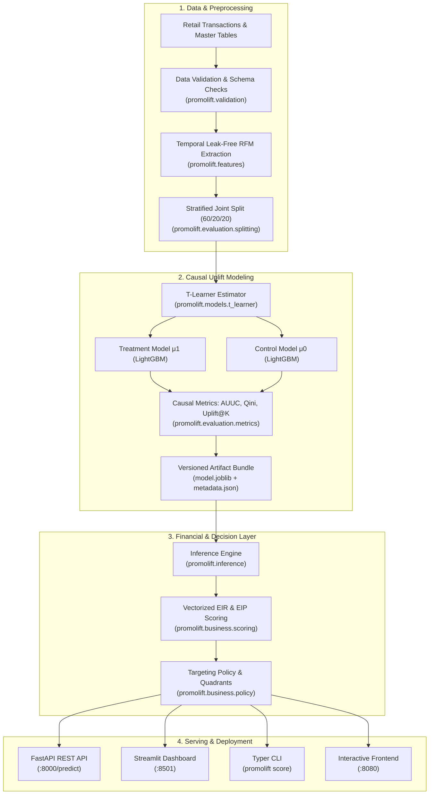

# PromoLift

> **A production-oriented uplift modeling and causal decision engine that optimizes retail promotional spend by targeting incremental customer profit and suppressing margin-destroying discounts.**

[](https://github.com/MTPeraya/promolift-model/actions)
[](https://www.python.org/)
[]()
[]()
[]()
[]()
[](https://opensource.org/licenses/MIT)

---

## Overview

Retail promotions frequently destroy profit through blanket discounting. Traditional machine learning approaches rely on **propensity models** (*"Who is most likely to buy?"*). However, high-propensity buyers frequently convert anyway without discounts, causing heavy margin cannibalization.

**PromoLift** reframes the problem as **causal inference and uplift modeling** (*"Who will buy specifically because of this promotion, and will their incremental margin exceed the promotional cost?"*).

PromoLift estimates customer-level Individual Treatment Effects (ITE) using a two-model **T-Learner** architecture, applies leak-free RFM feature engineering, and maps predicted uplift into **Expected Incremental Revenue (EIR)** and **Expected Incremental Profit (EIP)** to generate concrete promotional decisions (`TARGET`, `SKIP`, or `SLEEPING DOG`).

---

## Why Uplift Modeling?

In promotional campaigns, customers fall into four distinct causal quadrants:

| Customer Segment | Behavior Under Control (No Promo) | Behavior Under Treatment (Promo) | Blanket Blast Impact | PromoLift Policy |
|---|---|---|---|---|
| **Persuadables** | Would not buy | **Buys** | True incremental revenue | **TARGET** (if $EIP > 0$) |
| **Sure Things** | **Buys** | **Buys** | Cannibalized discount margin | **SKIP** (Protect margin) |
| **Lost Causes** | Would not buy | Would not buy | Wasted campaign & messaging cost | **SKIP** (Save budget) |
| **Sleeping Dogs** | **Buys** | Would not buy (Unsubscribe/Churn) | Negative lift & net revenue destruction | **NEVER DISTURB** |

### Mathematical Formulation

1. **Causal Uplift (Individual Treatment Effect $\tau_i$):**
   $$\tau_i = P(\text{Buy} = 1 \mid W = 1, X_i) - P(\text{Buy} = 1 \mid W = 0, X_i) = \mu_1(X_i) - \mu_0(X_i)$$

2. **Expected Incremental Revenue (EIR):**
   $$EIR_i = \tau_i \times \text{Price} - \text{Discount} \times \mu_1(X_i)$$

3. **Expected Incremental Profit (EIP):**
   $$EIP_i = \tau_i \times (\text{Price} - \text{COGS}) - \text{Discount} \times \mu_1(X_i) - \text{Cost}_{\text{campaign}}$$

**Targeting Decision Rule**:
* If $\tau_i < 0 \implies$ `SLEEPING DOG (DO NOT DISTURB)`
* Else if $EIP_i > 0 \implies$ `TARGET`
* Else $\implies$ `SKIP`

---

## Architecture



---

## Key Features

* **Strict Temporal Leakage Prevention**: Features are computed strictly using historical transactions prior to campaign dispatch cutoff (`reference_date = "2026-06-01"`).
* **Two-Model T-Learner**: Decoupled treatment and control gradient boosting classifiers (`LightGBM`) wrapped under an abstract `BaseUpliftModel` protocol.
* **Causal Evaluation Suite**: Full implementations of Qini Curves, Qini Score, Area Under the Uplift Curve (AUUC), Uplift@K, and Average Treatment Effect (ATE).
* **Pure Financial Optimization Layer**: Translates statistical uplift into real currency units (THB), directly balancing margins, discounts, and communication costs.
* **Multi-Format Inference**: High-throughput batch scoring via CLI (supporting Parquet and CSV) and low-latency REST API scoring (<5 ms).
* **Zero-Retrain UI**: Streamlit dashboard connects directly to the REST API or local serialized artifact without retraining models inside UI threads.

---

## Tech Stack

* **Language & Runtime**: Python 3.11 / 3.12
* **Machine Learning**: LightGBM, scikit-learn, joblib
* **Data Processing**: pandas, numpy, pyarrow
* **Type Safety & Schemas**: Pydantic v2, Mypy
* **Serving & Web**: FastAPI, Uvicorn, Streamlit, Nginx
* **CLI Engine**: Typer, Rich
* **Testing & Quality**: pytest, pytest-cov, Ruff
* **Containerization**: Multi-stage Docker, Docker Compose

---

## Project Structure

```text
promolift-model/
├── Dockerfile                  # Multi-stage container build (builder & minimal runtime)
├── docker-compose.yml          # Multi-service stack (API, Streamlit, Nginx Frontend)
├── Makefile                    # Standard developer automation commands
├── pyproject.toml              # Build config, package dependencies, CLI entry points
├── .github/workflows/ci.yml    # GitHub Actions CI (lint, mypy, pytest, build, docker-smoke)
├── data/                       # Retail mock transactions, customer master, products
│   ├── customer_features.parquet
│   └── data_dictionary.md
├── docs/
│   └── validation.md           # Empirical validation report with measured metrics
├── models/
│   └── production/             # Serialized production model bundle
│       ├── model.joblib        # Serialized treatment and control estimators
│       └── metadata.json       # Hyperparameters, test metrics, schema & git commit
├── outputs/                    # Scored customer lists and targeting recommendations
├── src/
│   ├── promolift/              # Core installable Python package
│   │   ├── api/                # FastAPI REST API implementation
│   │   ├── artifacts/          # Model artifact bundling, metadata, and loading
│   │   ├── business/           # Pure EIR/EIP financial math and targeting policies
│   │   ├── evaluation/         # Causal metrics (Qini, AUUC, Uplift@K, baselines)
│   │   ├── models/             # BaseUpliftModel protocol & TLearner implementation
│   │   ├── cli.py              # Typer CLI commands (train, score)
│   │   ├── features.py         # Leak-free RFM feature engineering
│   │   ├── inference.py        # Batch scoring engine
│   │   ├── pipeline.py         # End-to-end training and evaluation pipeline
│   │   ├── types.py            # Pydantic schemas, enums, and dataclasses
│   │   └── validation.py       # Data integrity and schema validators
│   └── app.py                  # Decoupled Streamlit optimization dashboard
└── tests/
    ├── api/                    # FastAPI test suite (HTTP status codes, schemas)
    ├── integration/            # Full end-to-end pipeline integration test
    ├── regression/             # Deterministic model metric regression protection
    └── unit/                   # Unit tests (features, math, policy, CLI, artifacts)
```

---

## Quick Start

### Docker (Recommended)

The entire multi-service stack (FastAPI + Streamlit Dashboard + Web Frontend) runs via Docker Compose with zero manual configuration:

```bash
# 1. Clone repository
git clone https://github.com/MTPeraya/promolift-model.git
cd promolift-model

# 2. Build and launch all services
docker compose up --build
```

#### Verified Service Endpoints

* **Streamlit Optimization Dashboard**: [http://localhost:8501](http://localhost:8501)
* **FastAPI Interactive Swagger Docs**: [http://localhost:8000/docs](http://localhost:8000/docs)
* **FastAPI Service Health**: [http://localhost:8000/health](http://localhost:8000/health)
* **Model Provenance & Test Metrics**: [http://localhost:8000/model-info](http://localhost:8000/model-info)
* **Interactive Web Frontend**: [http://localhost:8080](http://localhost:8080)

Run the automated container smoke test:
```bash
make docker-test
```

---

### Local Development

#### Prerequisites
* Python 3.11 or 3.12
* Git

```bash
# 1. Create and activate virtual environment
python3 -m venv .venv
source .venv/bin/activate

# 2. Install editable package with all extras
pip install --upgrade pip
pip install -e ".[all]"

# 3. Run full test suite with coverage
make test

# 4. Run linter and type checker
make lint
make typecheck
```

#### Train Model via CLI
```bash
python3 -m promolift.cli train --data-dir data --output-dir models/production --seed 42
```

#### Score Campaign via Batch CLI
```bash
python3 -m promolift.cli score \
  --campaign P001 \
  --input data/customer_features.parquet \
  --output outputs/targeting_list_sample.csv \
  --price 163.37 \
  --cogs 89.89 \
  --discount-rate 0.20 \
  --campaign-cost 0.50
```

---

## API Reference

The FastAPI service exposes high-performance REST endpoints for online inference and model observability.

### Endpoints

| Method | Path | Description | Verified Status |
|---|---|---|---|
| `GET` | `/health` | Service liveness, readiness, uptime, and model loading check | `HTTP 200` |
| `GET` | `/model-info` | Non-sensitive model version, git commit, training config & test metrics | `HTTP 200` |
| `POST` | `/predict` | Unified online scoring endpoint (accepts single customer or list) | `HTTP 200` |
| `POST` | `/score/single`| Dedicated single-customer scoring endpoint | `HTTP 200` |
| `POST` | `/score/batch` | Dedicated batch scoring endpoint | `HTTP 200` |

### Sample Request: `POST /predict`

```bash
curl -X POST http://localhost:8000/predict \
  -H "Content-Type: application/json" \
  -d '{
    "campaign_id": "P001",
    "customers": {
      "customer_id": "C0001",
      "recency_days": 10.0,
      "frequency_30d": 3.0,
      "monetary_90d": 500.0,
      "total_spend": 2000.0,
      "total_visits": 10.0,
      "total_items": 25.0,
      "avg_basket_value": 200.0,
      "promo_ratio": 0.20,
      "customer_segment_code": 3
    },
    "financial_params": {
      "price": 163.37,
      "cogs": 89.89,
      "discount_rate": 0.20,
      "campaign_cost": 0.50
    }
  }'
```

### Sample Response

```json
[
  {
    "customer_id": "C0001",
    "campaign_id": "P001",
    "p_treatment": 0.7214,
    "p_control": 0.2304,
    "uplift_score": 0.4910,
    "expected_incremental_revenue": 56.64,
    "expected_incremental_profit": 12.01,
    "uplift_segment": "Persuadal",
    "recommendation": "TARGET",
    "model_version": "0.1.0"
  }
]
```

---

## Model & Evaluation

### Training Methodology
* **Dataset Partition**: 600 Train (60%), 200 Validation (20%), 200 Untouched Holdout Test (20%).
* **Stratified Splitting**: Stratified jointly on treatment flag ($W \in \{0, 1\}$) and purchase outcome ($Y \in \{0, 1\}$) to ensure uniform treatment-to-control ratios across splits.
* **Leak-Free Features**: 9 RFM metrics calculated strictly on transactions before campaign cutoff date.

---

## Validation & Engineering Results

All results below are verified from direct executions on the repository codebase. See [`docs/validation.md`](docs/validation.md) for full benchmark outputs.

### 1. Engineering & Quality Validation

| Quality Check | Tool | Measured Result |
|---|---|---|
| **Test Suite** | `pytest` 9.0.1 | **33 passed**, 0 failed in 7.01s |
| **Code Coverage** | `pytest-cov` | **93%** total package coverage |
| **Linter** | `Ruff` | **PASS** (0 errors) |
| **Static Type Check** | `Mypy` | **PASS** (0 issues across 22 source files) |
| **Docker Smoke Test** | `make docker-test` | **PASS** (All 5 service health checks OK) |
| **Container Status** | `docker compose ps` | **3 / 3 services healthy** (`api`, `dashboard`, `frontend`) |

### 2. Machine Learning Holdout Metrics (N=200 Test Customers)

| Metric | Measured Value | Meaning |
|---|---|---|
| **AUUC (Area Under Uplift Curve)** | **0.0526** | Normalized cumulative causal response vs random baseline |
| **Qini Score** | **1.61** | Area between model gain curve and uniform random line |
| **Uplift @ 10%** | **0.3297** (33.0%) | Empirical causal lift in the top decile |
| **Uplift @ 20%** | **0.3262** (32.6%) | Empirical causal lift in the top 20% ranked customers |
| **Uplift @ 30%** | **0.1250** (12.5%) | Empirical causal lift in the top 30% ranked customers |
| **Average Treatment Effect (ATE)**| **0.1039** (10.39%) | Population-wide lift difference ($p_T - p_C$) |
| **Treatment Response Rate** | **0.5294** (52.94%) | Response rate among treated holdout customers |
| **Control Response Rate** | **0.4255** (42.55%) | Response rate among unprompted control holdout customers |

### 3. Business Strategy Simulation (Holdout Test N=200)

> [!NOTE]
> **Simulation Disclaimer**: The values below represent simulated financial outcomes calculated using campaign parameters on the repository's retail mock dataset ($Price = 163.37 \text{ THB}, COGS = 89.89 \text{ THB}, Discount = 20\%$). They do not represent real-world commercial results.

| Targeting Strategy | Targeted (N) | Target % | Expected Incremental Conversions | Expected Incremental Profit | Budget Cost Saved | Profit vs. Uniform Blast |
|---|---|---|---|---|---|---|
| **1. Uniform Blast (Target All)** | 200 | 100% | 20.78 | **-2,071.48 THB** | 0.0% | Baseline (0.00 THB) |
| **2. Customer Segment-Based** | 106 | 53% | 8.19 | **-1,312.08 THB** | 46.8% | +759.40 THB |
| **3. Propensity Top 30%** | 60 | 30% | 12.91 | **-350.81 THB** | 63.9% | +1,720.67 THB |
| **4. Uplift Top 30%** | 60 | 30% | 19.05 | **+226.58 THB** | 67.4% | +2,298.06 THB |
| **5. Value-Optimized Uplift ($EIP > 0$)**| 44 | 22% | 15.13 | **+276.35 THB** | **76.8%** | **+2,347.83 THB** |

*Key finding: Blanket and Propensity targeting both result in negative incremental profit by granting unnecessary discounts to Sure Things who would have bought anyway. Uplift targeting delivers positive net incremental profit while cutting promotional budget costs by 76.8%.*

### 4. Local Performance Benchmarks

* **Batch Scoring Throughput**: **10,000 customers scored in 12.41 ms** (~1.24 µs / customer, ~805,800 customers/sec) on Apple Silicon.
* **REST API Latency** (`POST /predict` over 50 requests):
  * **Mean**: 4.92 ms
  * **p50**: 4.90 ms
  * **p95**: 5.35 ms
  * **p99**: 5.47 ms

---

## Deployment

### Multi-Stage Docker Build
The project uses a clean multi-stage `Dockerfile`:
1. **Builder Stage**: Installs compiler tools (`build-essential`, `libgomp1`), caches dependencies independently from source changes, and compiles wheels.
2. **Runtime Stage**: Installs wheels into a minimal `python:3.12-slim` image, creates a dedicated non-root application user (`appuser:10001`), packages model artifacts, and configures native Docker healthchecks.

### Docker Compose Architecture
* `api`: FastAPI inference service running Uvicorn on port `8000`.
* `dashboard`: Streamlit campaign optimization dashboard on port `8501`, depending on `api` health.
* `frontend`: Alpine Nginx web server hosting interactive UI on port `8080`, listening on IPv4 and IPv6.

---

## Limitations

1. **Synthetic / Mock Data**: The dataset bundled with the repository is a synthetic retail database. While designed to accurately reflect retail RFM distributions and treatment response dynamics, performance figures should be interpreted as simulation benchmarks rather than real-world campaign metrics.
2. **Unconfoundedness Assumption**: The T-Learner estimator assumes treatment assignment is conditionally unconfounded given observed covariates ($Y(1), Y(0) \perp W \mid X$). In a real production deployment, this requires randomized holdout experiments (A/B testing) or propensity score weighting.
3. **Single-Item Cross-Elasticity**: Current EIR/EIP formulas calculate incremental profit per campaign product and do not yet model cross-category basket cannibalization.
4. **Local Hardware Benchmarking**: Throughput and latency figures reflect local development hardware (Apple Silicon) and will vary based on production cloud compute, vCPU allocations, and network topography.

---

## Roadmap

- [x] Strict temporal feature engineering & leakage prevention
- [x] T-Learner causal uplift model with LightGBM estimators
- [x] Causal evaluation metrics (Qini curve, AUUC, Uplift@K)
- [x] Vectorized Expected Incremental Revenue (EIR) and Profit (EIP) formulas
- [x] Production FastAPI REST service with Pydantic validation
- [x] Decoupled Streamlit campaign optimization dashboard
- [x] Containerized multi-service deployment with healthchecks
- [x] 93% test coverage and CI workflow
- [ ] X-Learner and DR-Learner estimators for imbalanced treatment groups
- [ ] Cross-category product substitution and elasticity modeling
- [ ] Automated drift detection (Kolmogorov-Smirnov monitoring for RFM feature drift)

---

## License

This project is licensed under the MIT License - see the [LICENSE](LICENSE) file for details.
